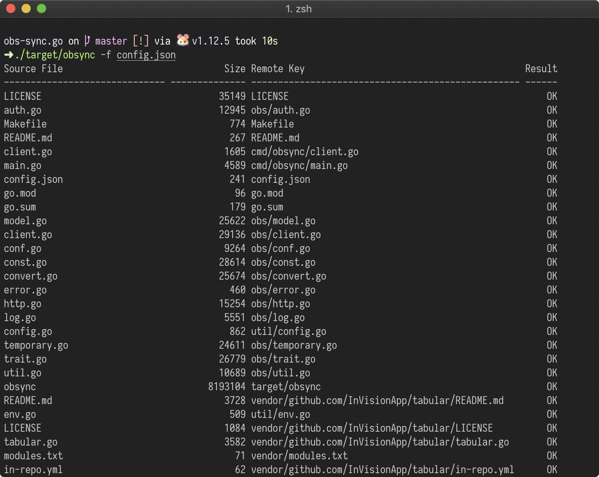

# Obsync - 主流公有云对象存储服务同步工具



## 更新历史

- 20220314 增加 阿里云盘 的同步功能；增加回调测试
- 20210918 更新 Golang 的编译版本，重构部分代码
- 20200524 修改代码结构，增加 Standalone 定时同步
- 20190709 提供腾讯云（COS）、七牛云、又拍云同步功能
- 20190706 抽象接口，提供华为云、阿里云同步功能
- <del>20190614 增加 PID 文件支持</del>（已废弃）
- 20190610 修复一些问题，并增加超时参数
- 20190605 完成基本功能

## 概述

起先，这个是个针对华为云对象存储服务（OBS）的目录同步工具，支持多线程同步本地的目录到 OBS 的对象存储。第二版本的时候，代码重构了以后理论上支持各种对象存储（只要实现对应的 interface 即可）。

### @TODO

- 增加用例测试
- 使用 Watch Directory 的方式监控文件变更并更新上传

## 编译

由于使用了 golang mod，所以建议使用 golang 1.11 及以上版本进行编译。请参考 Makefile 即可，使用 `make build` 编译以及 `make install` 安装到 `$GOPATH/bin` 中。

## 配置

请参考 `config-example.json` 的配置文件，其中主要的配置项如下：

```json
{
  "debug": true,
  "root": ".",
  "standalone": true,
  "interval": 24,
  "buckets": [
    {
      "type": "test",
      "thread": 5,
      "name": "test",
      "timeout": 60,
      "force": true
    }
    // ...
  ]
}
```

注意，默认的每个 bucket 的 timeout 时间单位为秒，而 standalone 的 interval 默认单位时间为小时。

支持一对多同步到同一个以及不同的对象存储平台（详细技术细节请查看插件部分）。

## 运行

运行的参数很简单，主要配置项目在配置文件中：

```
  -f string
        config file path (default "$HOME/.obsync.json")
  -i    print bucket info and exit
  -v    print version and exit
```

### 使用 systemd （已经废弃）

使用 systemd 可以非常方便得在 Linux 系统下管理应用的启动方式。参考文件 `obsync.service` 以及 `obsync.timer` 文件，默认每一个小时重启（扫描一次）应用。

基于用户运行的方式安装，则拷贝上述对应的两个文件到 `$HOME/.config/systemd/user`，同时注意执行文件以及配置文件的路径。然后，刷新 `systemctl --user daemon-reload` 后执行 `systemctl --user start obsync.timer` 即可运行。如想自动启动，则运行 `systemctl --user enable obsync.timer` 即可。

### 使用 Docker 镜像部署

简单的可以使用

```
docker pull docker.pkg.github.com/mingcheng/obsync/obsync:latest
```

拉取镜像，默认的配置路径为 `/etc/obsync.json` ，注意进行本地映射以及权限。


## 编写插件

如果 obsync 目前还不支持您需要同步的对象存储平台，您可以使用简单的方式去扩展它。可以先插件在源代码目录中的 `./cmd/obsync/buckes` 目录下的文件，它们都是对应不同对象存储平台的实现。

其中，`test.go` 是个 `TestBucket` 顾名思义它什么都不用做，它的「上传操作」就是简单的 Sleep 几秒而已，我们可以很容易的拿它来作为快速实现的模板。

```golang
// 定义个 Bucket 的名称
type TestBucket struct {
	Config obsync.BucketConfig
}

// 获取信息
func (t TestBucket) Info() (interface{}, error) {
	return "This is a test bucket", nil
}

// 判断对应的文件是否存在
func (t TestBucket) Exists(path string) bool {
	return false
}

// 文件上传的实现
func (t TestBucket) Put(task obsync.BucketTask) {
	time.Sleep(time.Duration(rand.Intn(10)) * time.Second)
}

// 初始化以及注册插件
func init() {
obsync.RegisterBucket("test", func (config obsync.BucketConfig) (obsync.Bucket, error) {
return TestBucket{
Config: config,
}, nil
})
}
```

注，v1.3.0 以后，增加了两个回调接口：

```go
func (t TestBucket) OnStart(ctx context.Context) error {
return nil
}

func (t TestBucket) OnStop(ctx context.Context) error {
return nil
}
```

分别对应在开始以及结束的时候的回调执行，方便扩展以及资源的管理。

以上，实现了以后就可以编写对应的配置文件即可开始使用。其中的多线程的处理以及实现在 `task.go` 这个文件中（如果有需要您可以扩展它，欢迎提交 PR 给我）。

`- eof -`
