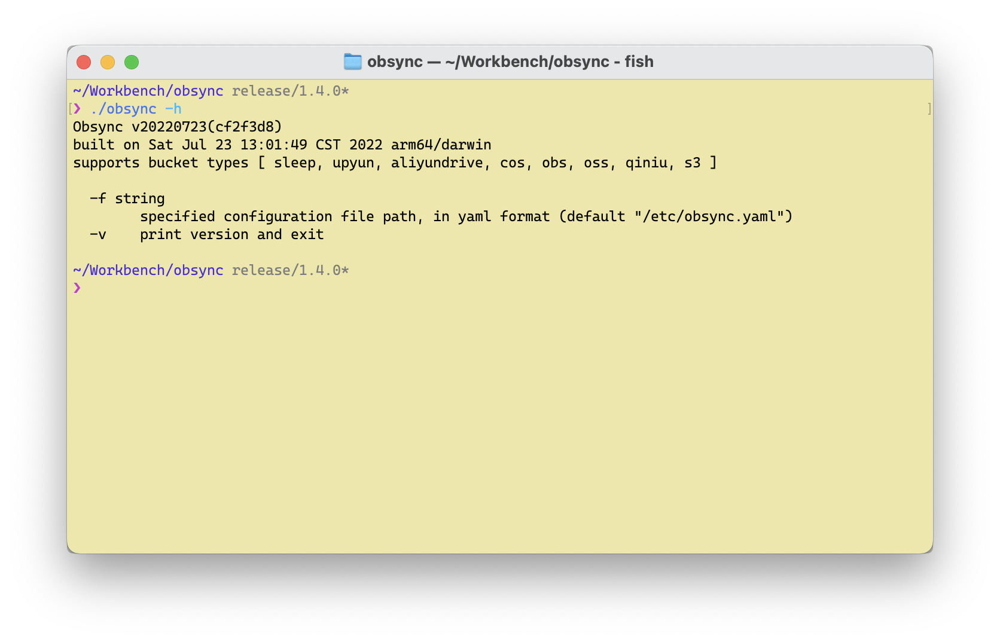

# Obsync - 华为云对象存储服务（OBS）同步工具



## 更新历史

* 20190605 完成基本功能

## 概述

这个是个针对华为云对象存储服务（OBS）的目录同步工具，支持多线程同步本地的目录到 OBS 的 Bucket。

## 编译

由于使用了 golang mod，所以建议使用 golang 1.11 及以上版本进行编译。请参考 Makefile 即可，使用 `make build` 编译以及 `make install` 安装到 `$GOPATH/bin` 中。

## 配置

请参考 `config-example.json` 的配置文件，其中主要的配置项如下：

```json
{
  "debug": false, // 是否打开 Debug 模式
  "force": false, // 是否强制覆盖远程文件，默认远程文件如果存在则不覆盖
  "root": ".", // 本地同步目录
  "secret": "<secret>",
  "key": "<key>",
  "endpoint": "<endpoint>",
  "bucket": "<bucket-name>",
  "thread": 5 // 使用上传的线程数
}
```

## 运行

运行的参数很简单，主要配置项目在配置文件中：

```
  -f string
        config file path (default "$HOME/.obsync.json")
  -i    print bucket info and exit
  -v    print version and exit
```

`- eof -`
